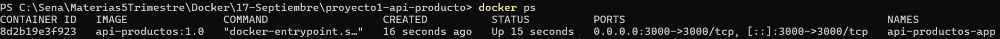
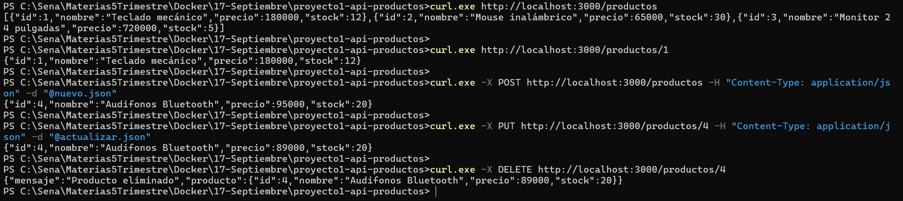

# Proyecto 1 — API REST de Productos en Docker

API REST de gestión de productos desarrollada con Node.js y Express, empaquetada
en una imagen Docker propia para poder ejecutarse en cualquier equipo sin
necesidad de instalar Node.js.

**Autora:** Mariana Uribe Muñoz
**Programa:** Análisis y Desarrollo de Software (ADSO) — SENA
**Ficha:** 3229209
**Instructor:** Richard Betancur

---

## Requisitos

- Docker Desktop instalado y en ejecución
- Git
- Opcional: `curl` o Postman para probar los endpoints

No se requiere Node.js instalado en la máquina anfitriona: las dependencias se
instalan dentro de la imagen.
---

## Estructura del proyecto

```
proyecto1-api-productos/
├── evidencias/
│   ├── 01-docker-ps.png
│   └── 02-endpoints-crud.png
├── .dockerignore
├── .gitignore
├── Dockerfile
├── index.js
├── package.json
└── README.md
```
---

## Construcción y ejecución

### 1. Clonar el repositorio

```bash
git clone https://github.com/marianauribe57-art/proyecto1-api-productos.git
cd proyecto1-api-productos
```

### 2. Construir la imagen

```bash
docker build -t api-productos:1.0 .
```

Se utiliza la etiqueta `1.0` en lugar de `latest` para fijar una versión
explícita y garantizar builds reproducibles.

### 3. Ejecutar el contenedor

```bash
docker run -d -p 3000:3000 --name api-productos-app api-productos:1.0
```

| Opción | Función |
|---|---|
| `-d` | Ejecuta el contenedor en segundo plano (detached) |
| `-p 3000:3000` | Publica el puerto del contenedor en la máquina anfitriona |
| `--name` | Asigna un nombre fijo al contenedor |

La API queda disponible en `http://localhost:3000`.

### 4. Administración del contenedor

```bash
docker ps                          # listar contenedores en ejecución
docker logs api-productos-app      # inspeccionar logs
docker stop api-productos-app      # detener
docker rm api-productos-app        # eliminar
```
---

## Endpoints

| Método | Ruta | Descripción | Respuestas |
|---|---|---|---|
| GET | `/productos` | Lista todos los productos | 200 |
| GET | `/productos/:id` | Obtiene un producto por su id | 200, 404 |
| POST | `/productos` | Crea un producto nuevo | 201, 400 |
| PUT | `/productos/:id` | Actualiza un producto existente | 200, 404 |
| DELETE | `/productos/:id` | Elimina un producto | 200, 404 |

Los datos se almacenan en memoria, por lo que se reinician al recrear el
contenedor.

### Ejemplos de uso

```bash
# Listar todos los productos
curl http://localhost:3000/productos

# Obtener un producto
curl http://localhost:3000/productos/1

# Crear un producto
curl -X POST http://localhost:3000/productos \
  -H "Content-Type: application/json" \
  -d '{"nombre":"Audifonos Bluetooth","precio":95000,"stock":20}'

# Actualizar un producto
curl -X PUT http://localhost:3000/productos/4 \
  -H "Content-Type: application/json" \
  -d '{"precio":89000}'

# Eliminar un producto
curl -X DELETE http://localhost:3000/productos/4
```

> **Nota para Windows (PowerShell):** usar `curl.exe` en lugar de `curl` y
> pasar el cuerpo JSON desde un archivo con `-d "@archivo.json"`, ya que
> PowerShell interfiere con el escape de las comillas.
---

## Evidencias

### Contenedor en ejecución

Salida de `docker ps` mostrando el contenedor activo, el mapeo de puertos
`0.0.0.0:3000->3000/tcp` y la inspección de logs.



### Endpoints funcionando

Prueba completa del CRUD: listado, consulta individual, creación (id 4),
actualización del precio y eliminación.



---

## Decisiones técnicas

- **Imagen base `node:20-alpine`:** variante liviana (49.8 MB de contenido)
  con la versión mayor fijada para garantizar reproducibilidad.
- **Orden de instrucciones en el Dockerfile:** se copia primero
  `package*.json` y se ejecuta `npm install` antes de copiar el código
  fuente, de modo que la capa de dependencias se reutilice desde la caché
  cuando solo cambia el código.
- **`.dockerignore`:** excluye `node_modules` para evitar copiar binarios
  compilados para otra plataforma,